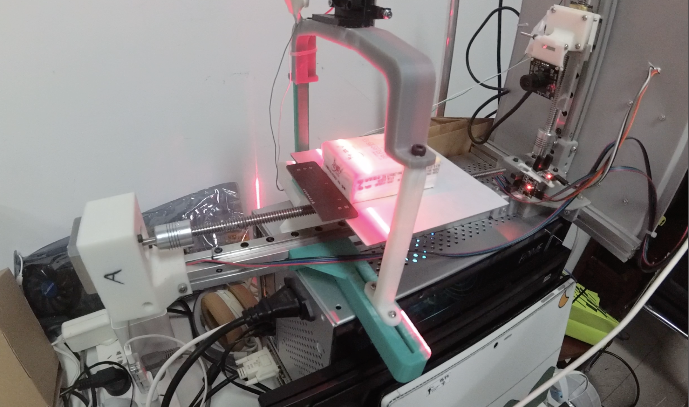
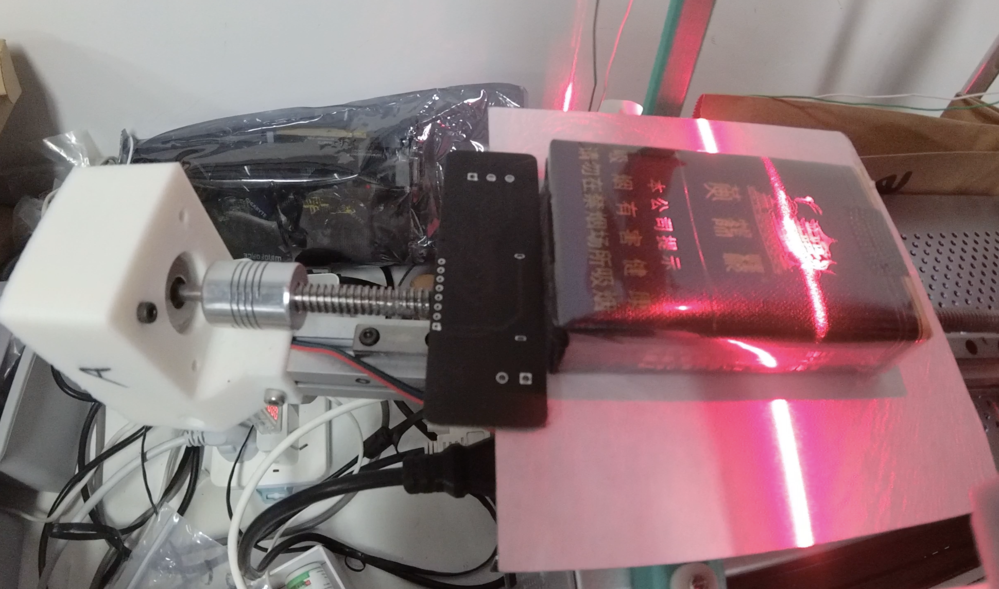
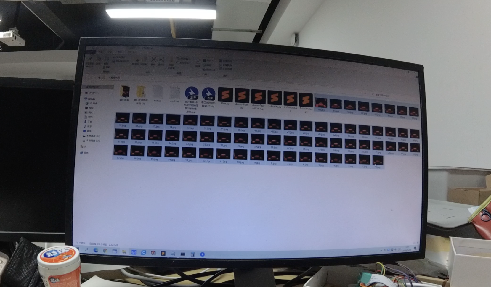
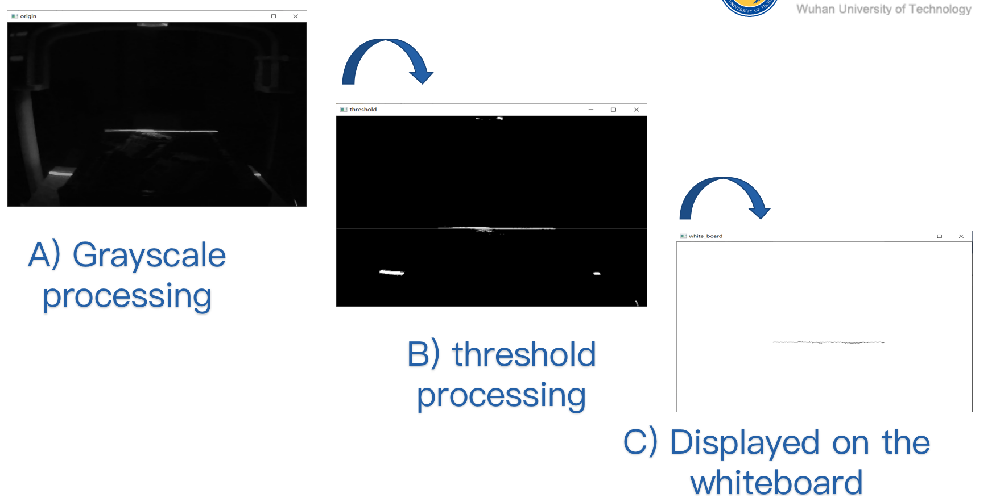
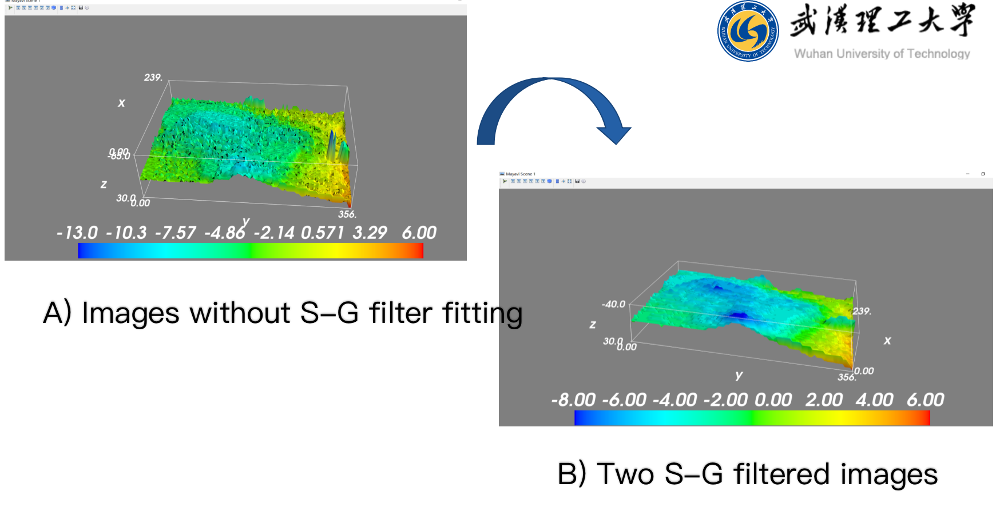
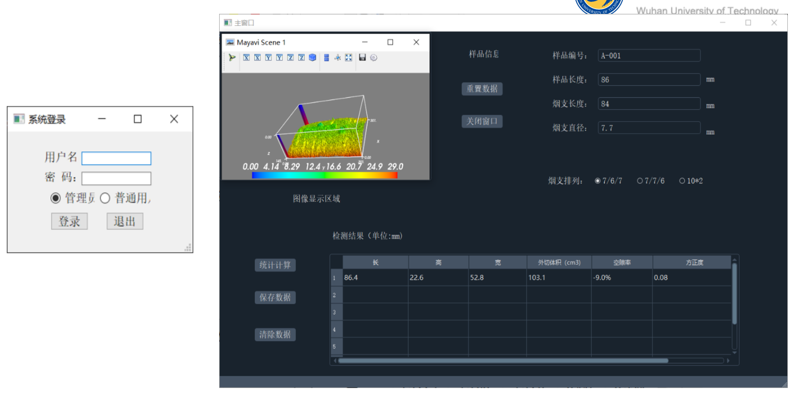

# Defect_Detection_Project

## WUT Computer Vision Lab

### Research Software Developer Intern

• Implemented a Python-based software system using OpenCV to process and analyze image data from a 3-D scanning device designed by the team, targeting package defect detection.

• Optimized image processing algorithms to binarize and filter the captured image data, increasing the accuracy rate from 70% to 96%. Applied MySQL for data storage and retrieval.

• Developed a web application using Django and JavaScript to enable remote control and monitoring of the device, incorporating a user-friendly interface and real-time data visualization features.

• Carried out experiments with samples, delivering efficiency improvements of 25% to the tobacco company client.

#### 1) Hardware Machine :

#### 2) Scan the Sample Package :

#### 3) Collect Images :

#### 4) Binarize and Filter Images :

==Otsu threshold method==

==Savitzky-Golay Filter==

#### 5) User Interface and App:

